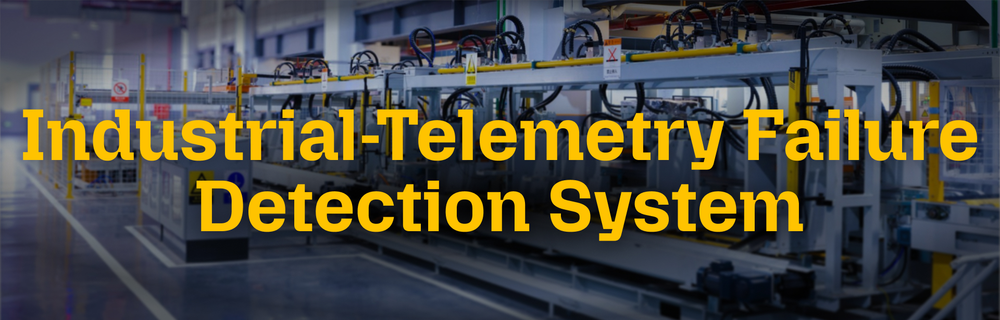

# Industrial Telemetry Replay & Failure Detection System

A fast, high-performance C++17 command-line application that analyzes industrial machine telemetry data from CSV, calculates real-time health scores, detects failure conditions, and outputs results to CSV.

## Project Overview

This system provides predictive maintenance monitoring where:
- **CSV telemetry data** (temperatures, speeds, torque, wear) is processed
- **Health scores** are calculated using a multi-factor algorithm  
- **Failure detection** identifies warning and critical conditions
- **CSV results** capture all detection events for analysis

## Features

### 1. Health Score Calculator
Multi-factor weighted algorithm:
- **Tool Wear (35%)** - Accumulates from 0-250+min
- **Temperature (25%)** - Deviation from normal air/process temps
- **Torque Stress (25%)** - Deviation from 40Nm baseline
- **Rotational Speed (15%)** - Anomaly detection from 1500rpm baseline

Score Range: 0.0 (Critical) → 100.0 (Healthy)
Status Thresholds:
- `CRITICAL`: score < 40
- `WARNING`: 40 ≤ score < 70
- `HEALTHY`: score ≥ 70

### 2. Failure Detection 
Real-time detection of:
- **Critical Failures**: Score < 40, extreme temps (>315K), excessive wear (>240min), extreme torque (>70Nm)
- **Warnings**: Score 40-70, rising temps (>312K), tool wear (>180min), elevated torque (>55Nm)
- **Root Cause Analysis**: Identifies primary degradation factor
- **Accuracy Validation**: Compares against actual recorded failures

### 3. CSV Output
Detection results written to CSV with:
- Row number, event type, health score, status
- Event description and accuracy flag

## Dataset Information

**Source**: [AI4I 2020 Predictive Maintenance - Kaggle](https://www.kaggle.com/datasets/shivamb/machine-predictive-maintenance-classification)

**Structure**: 10,000 records with 13 columns:
- `UDI`: Unique ID
- `Product ID`: Machine identifier (Type M, L, or H)
- `Type`: Product type (M, L, H)
- `Air temperature [K]`: Ambient temperature
- `Process temperature [K]`: Operating temperature
- `Rotational speed [rpm]`: Spindle/motor speed
- `Torque [Nm]`: Mechanical load
- `Tool wear [min]`: Accumulated tool degradation
- `Machine failure`: Target label (0/1)
- `TWF`, `HDF`, `PWF`, `OSF`, `RNF`: Failure type indicators

## Building

### Requirements
- CMake 3.16+
- C++17 compiler (g++, clang, or MSVC)
- Standard C++ library (Threads)

### Build Instructions
```bash

mkdir build && cd build
cmake ..
make
```

### Output
Executable: `./industrial_monitor`

## Usage

### Basic (Default Paths)
```bash
./build/industrial_monitor
```
Reads from `data/equipment_telemetry.csv` → outputs to `output/results.csv`

### Custom Input File
```bash
./build/industrial_monitor --input data/equipment_telemetry.csv
```

### Custom Input and Output
```bash
./build/industrial_monitor --input data/custom.csv --output output/custom_results.csv
```

### Process Limited Rows
```bash
./build/industrial_monitor --limit 5000
```

### With Detailed Report
```bash
./build/industrial_monitor --output output/results.csv --report output/report.txt
```

### All Options Combined
```bash
./build/industrial_monitor --input data/equipment_telemetry.csv --output output/equipment_results.csv --limit 2000 --report output/equipment_report.txt
```

### Help
```bash
./build/industrial_monitor --help
```

## Command-Line Options
| Option | Argument | Default | Description |
|--------|----------|---------|-------------|
| `--input` | filepath | data/ai4i2020.csv | Input CSV file |
| `--output` | filepath | output/results.csv | Output CSV file |
| `--limit` | number | all | Max records to process |
| `--report` | filepath | (none) | Optional detailed report |
| `--help` | - | - | Show usage information |

## Example Output

```
✓ CSV written to: output/results.csv

✓ Computation completed successfully

Results Summary:
  Records Processed:     10000 / 10000
  Actual Failures:       339
  Critical Detections:   259
  Detection Accuracy:    8.8%
```

## Output CSV Format

**File**: `output/results.csv`

```csv
row_number,event_type,health_score,status,description,is_accurate
67,WARNING,83.30,HEALTHY,Multi-factor degradation detected,false
70,FAILURE_CONFIRMED,75.41,HEALTHY,Multi-factor degradation detected,true
75,WARNING,80.11,HEALTHY,Critical tool wear (202min),false
```

Columns:
- `row_number`: Row in input CSV
- `event_type`: WARNING, CRITICAL, or FAILURE_CONFIRMED
- `health_score`: Calculated health score (0-100)
- `status`: HEALTHY, WARNING, or CRITICAL
- `description`: Human-readable event description
- `is_accurate`: Whether detection matched actual failure

## Architecture

### Core Components

```
main.cpp
  ├── ReplayEngine (replay_engine.h/cpp)
  │   ├── CsvParser (csv_parser.h/cpp)
  │   └── FailureDetector (failure_detector.h/cpp)
  │       └── HealthCalculator (health_calculator.h/cpp)
  └── ReportGenerator (report_generator.h/cpp)
```

### Data Flow
1. **CSV Loading**: CsvParser reads file → TelemetryRecord objects
2. **Processing Loop**: Each record is processed instantly (no delays)
3. **Health Calculation**: Multi-factor algorithm scores machine health
4. **Failure Detection**: Pattern matching identifies warning/critical states
5. **CSV Output**: Results written directly to file
6. **Summary**: Statistics printed to console

## Algorithm Details

### Health Score Calculation

For each record:
1. Calculate component scores (0-100):
   - `temperatureScore`: Penalizes deviation from normal temps
   - `speedScore`: Detects rotational anomalies
   - `torqueScore`: Evaluates mechanical stress
   - `wearScore`: Tracks cumulative tool degradation

2. Weighted average:
   ```
   health = (wear×0.35) + (temp×0.25) + (torque×0.25) + (speed×0.15)
   ```

3. Determine status:
   - score < 40 → CRITICAL
   - 40 ≤ score < 70 → WARNING
   - score ≥ 70 → HEALTHY

### Failure Detection Strategy

**Critical Conditions** (immediate alert):
- Health score < 40
- Process temperature > 315K
- Tool wear > 240 minutes
- Torque > 70 Nm

**Warning Conditions** (trend alert):
- Health score 40-70
- Process temperature > 312K
- Tool wear > 180 minutes
- Torque > 55 Nm

## File Structure

```
industrial-telemetry-replay-cpp/
├── CMakeLists.txt
├── README.md
├── build/
├── data/
│   ├── ai4i2020.csv
│   └── equipment_telemetry.csv
├── include/
│   ├── csv_parser.h
│   ├── telemetry_record.h
│   ├── health_calculator.h
│   ├── failure_detector.h
│   ├── replay_engine.h
│   └── report_generator.h
├── output
│   └── results.csv
└── src/
    ├── main.cpp
    ├── csv_parser.cpp
    ├── telemetry_record.cpp
    ├── health_calculator.cpp
    ├── failure_detector.cpp
    ├── replay_engine.cpp
    └── report_generator.cpp
```

## Future Improvements

Potential improvements:
- Machine learning-based anomaly detection
- Web GUI dashboard for real-time monitoring
- Live data integration and monitoring with notifications
- Statistical threshold auto-tuning
- Predictive maintenance (forecast failures before occurrence)
- Database backend for historical analysis


## References

- AI4I 2020 Dataset: https://www.kaggle.com/datasets/shivamb/machine-predictive-maintenance-classification
